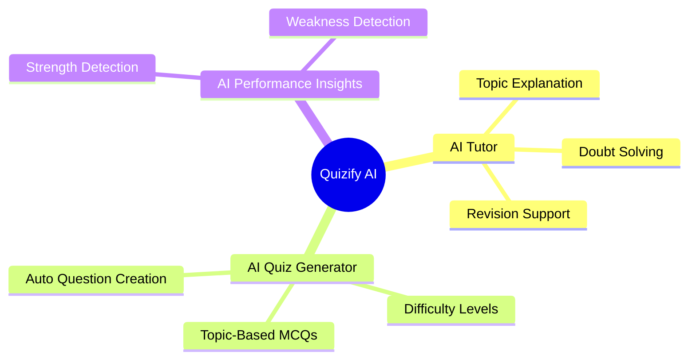
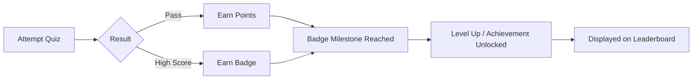
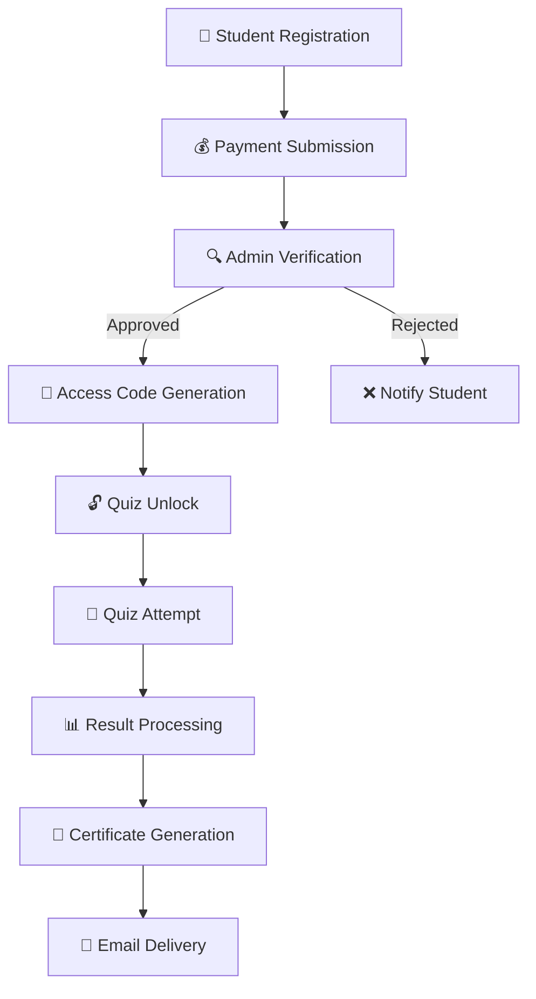
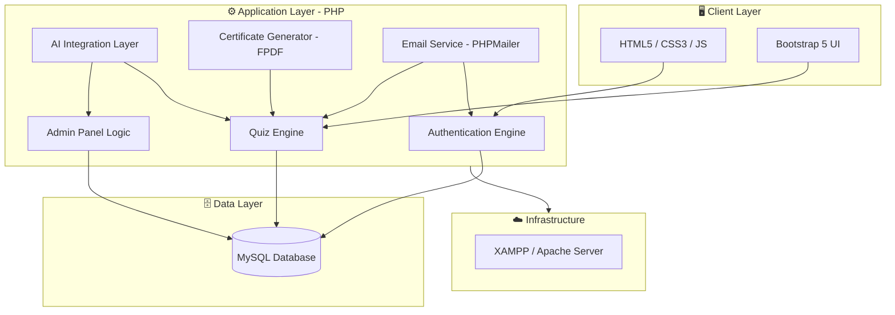
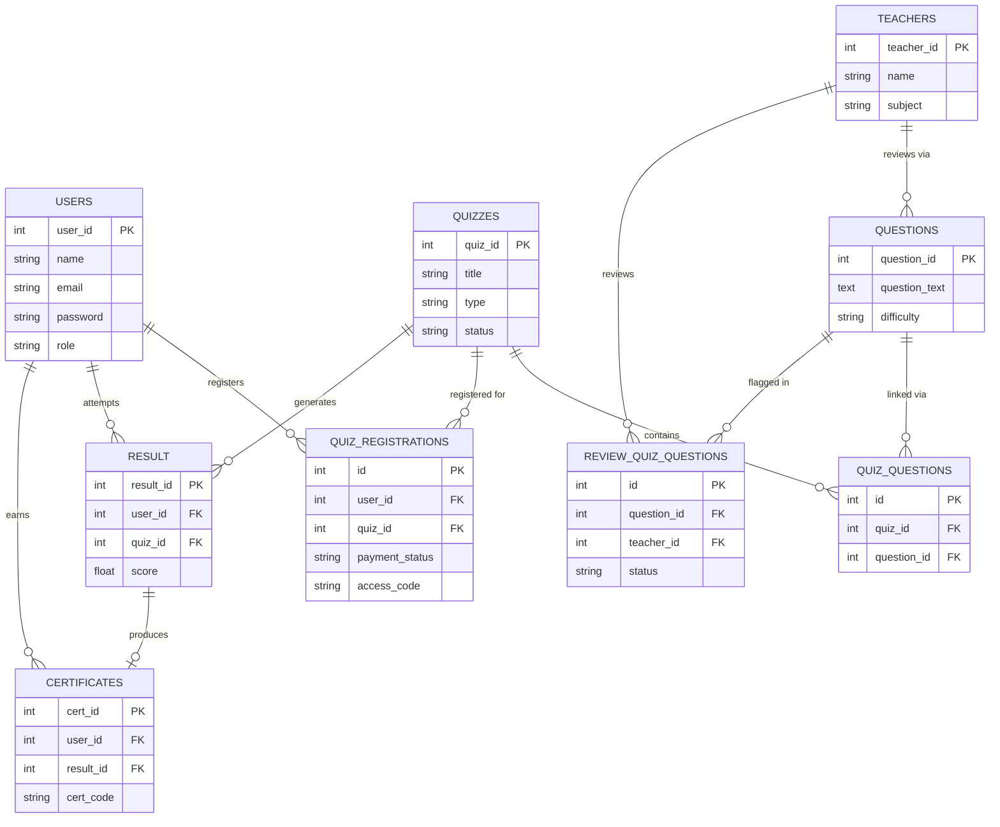
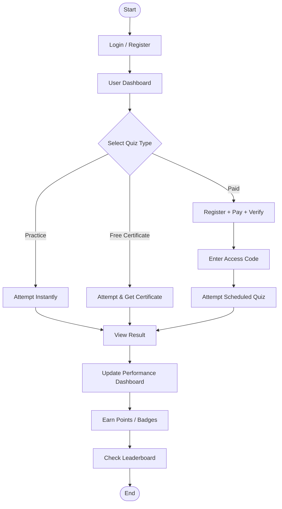
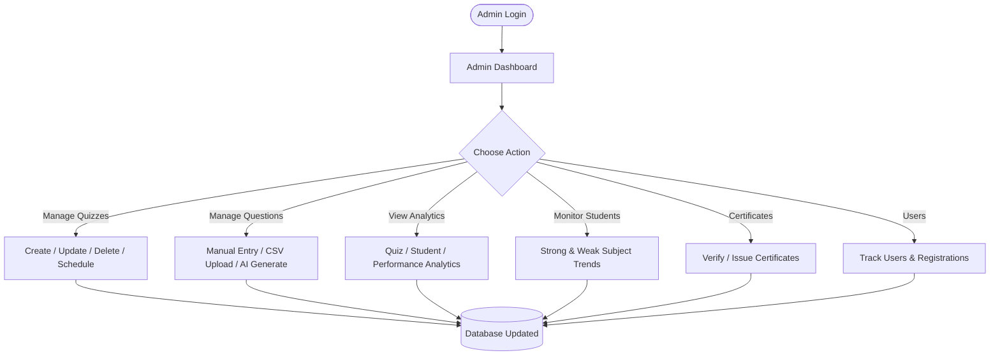
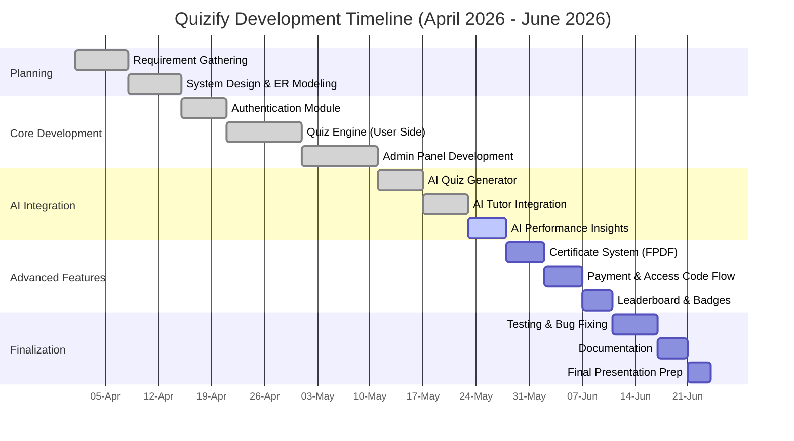

<div align="center">

# 🧠 Quizify

### A Smart Online Quiz Management System with AI Features
**Learn. Compete. Get Certified. Powered by AI.**

[](https://www.php.net/)
[](https://www.mysql.com/)
[](https://getbootstrap.com/)
[](https://www.apachefriends.org/)
[](#-license)
[](#)
[](#-api-integrations)
[](#-api-integrations)
<br/>

**A full-stack, AI-integrated quiz and assessment platform built as a Final Year BCA Project**
**by [Yash Gupta](#-contributors) & [Arjab Jain](#-contributors) · ITM University Gwalior**

<br/>

[Overview](#-executive-summary) •
[Features](#-key-features) •
[Architecture](#-system-architecture) •
[Installation](#-installation-guide) •
[Database](#-database-design) •
[Roadmap](#-future-enhancements)

</div>

---

## 📌 Table of Contents

<details open>
<summary><strong>Click to expand / collapse</strong></summary>

1. [Executive Summary](#-executive-summary)
2. [Problem Statement](#-problem-statement)
3. [Solution Overview](#-solution-overview)
4. [Key Features](#-key-features)
5. [User Dashboard Features](#-user-dashboard-features)
6. [Admin Dashboard Features](#-admin-dashboard-features)
7. [AI Features](#-ai-features)
8. [Reward & Badge System](#-reward--badge-system)
9. [Certificate System](#-certificate-system)
10. [Paid Quiz Workflow](#-paid-quiz-workflow)
11. [System Architecture](#-system-architecture)
12. [Database Architecture (ER Diagram)](#-database-architecture-er-diagram)
13. [User Flow Diagram](#-user-flow-diagram)
14. [Admin Workflow Diagram](#-admin-workflow-diagram)
15. [Technology Stack](#-technology-stack)
16. [Folder Structure](#-folder-structure)
17. [Database Design](#-database-design)
18. [Installation Guide](#-installation-guide)
19. [Configuration Guide](#-configuration-guide)
20. [Security Features](#-security-features)
21. [Analytics Module](#-analytics-module)
22. [AI Tutor Module](#-ai-tutor-module)
23. [AI Quiz Generator Module](#-ai-quiz-generator-module)
24. [Development Timeline](#-development-timeline)
25. [Challenges Faced](#-challenges-faced)
26. [Future Enhancements](#-future-enhancements)
27. [Contributors](#-contributors)
28. [Screenshots](#-screenshots)
29. [Acknowledgements](#-acknowledgements)
30. [License](#-license)

</details>

---

## 🧭 Executive Summary

> **Quizify** is an AI-powered online assessment and quiz management platform designed to bridge the gap between traditional testing systems and modern, intelligent, learner-centric education technology.

Built as a **full-stack web application**, Quizify enables institutions and independent learners to create, manage, and attempt quizzes — ranging from free practice tests to paid, certificate-backed examinations — while leveraging **AI-Features tutoring, automated question generation, and performance analytics** to personalize the learning journey.

The system is architected around **two core dashboards** — a **Student/User Dashboard** and an **Admin Dashboard** — each purpose-built to serve their respective workflows with clarity, speed, and security.

| Attribute | Detail |
|---|---|
| 🏫 Institution | ITM University Gwalior |
| 🎓 Course | Bachelor of Computer Applications (BCA) |
| 🗂️ Project Type | Academic + Real-World Full Stack Web Application |
| 📅 Duration | April 2026 – June 2026 |
| 👨‍💻 Team Size | 2 Developers |
| 🧱 Architecture | Monolithic MVC-inspired PHP Application |
| 🤖External API Integrations | Gemini API for AI Tutor, Grok API for Quiz Generation

---

## ❗ Problem Statement

Traditional academic quiz/exam systems typically suffer from:

- 📄 **Manual question creation** that is slow and error-prone
- 📉 **No personalized feedback** — students don't know *why* they're weak in a topic
- 🏆 **No motivation layer** — no gamification, badges, or leaderboard to drive engagement
- 💳 **No structured monetization path** for premium/certification-based assessments
- 🧾 **Manual certificate issuance**, which is time-consuming and inconsistent
- 📊 **Lack of actionable analytics** for both students and administrators

## ✅ Solution Overview

Quizify addresses these gaps through a unified platform that combines:

- 🤖 **AI-assisted content creation** (auto-generated MCQs by topic & difficulty)
- 🎯 **Personalized AI tutoring** for doubt-solving and revision
- 🏅 **Gamified learning** via badges, points, and leaderboards
- 💼 **A complete paid-quiz commerce flow** with verification and access codes
- 📜 **Automated PDF certificate generation** with unique verifiable IDs
- 📈 **Deep analytics dashboards** for both learners and administrators

---

## ⭐ Key Features

<table>
<tr>
<td width="50%" valign="top">

### 👨‍🎓 For Students
- 🔐 Secure registration & authentication
- 📝 Practice, Free-Certificate & Paid Quiz modes
- 🤖 AI Tutor for doubt-solving
- 🏆 Real-time Leaderboards
- 📊 Personal performance dashboard
- 🎖️ Badge & reward point system
- 📜 Auto-generated downloadable certificates
- 🔔 Smart notifications & reminders

</td>
<td width="50%" valign="top">

### 🛠️ For Administrators
- 🧩 Full quiz lifecycle management
- 📥 CSV bulk question upload
- 🤖 AI-powered quiz generation
- 📈 Analytics & AI-driven insights
- 👁️ Student monitoring (strengths/weaknesses)
- ✅ Certificate verification & issuance
- 👥 User & registration tracking
- 📅 Quiz scheduling engine

</td>
</tr>
</table>

---

## 👨‍🎓 User Dashboard Features

### 🔐 Authentication
- Registration
- Login
- Profile Management
- Session Management

### 🧪 Quiz Types

| Quiz Type | Access | Result | Certificate | Notes |
|---|---|---|---|---|
| 🆓 **Practice Quiz** | Free | Instant | ❌ | Unlimited attempts for self-practice |
| 🎓 **Free Certificate Quiz** | Free | Instant | ✅ | Certificate issued upon passing |
| 💳 **Paid Quiz** | Registration + Payment | Scheduled | ✅ | Access-code protected, scheduled exam |

### 🤖 AI Tutor
- Topic Explanation
- Revision Support
- Doubt Solving
- Personalized Learning Support

### 🏆 Leaderboard
- Ranking System
- Score Comparison
- Competitive Learning

### 📊 Performance Dashboard
- Quiz History
- Subject-wise Performance
- Strong Areas / Weak Areas
- Progress Tracking

### 🎖️ Badge System
- Point Collection
- Achievement Levels
- Rewards

### 🔔 Notification System
- New Quiz Alerts
- Exam Reminders
- Result Notifications
- Platform Updates

### 📜 Certificate System
- Auto Generated Certificates
- Downloadable PDF Certificates
- Unique Certificate IDs

---

## 🛠️ Admin Dashboard Features

<details>
<summary><strong>🧩 Quiz Management</strong></summary>

- Create Quiz
- Update Quiz
- Delete Quiz
- Schedule Quiz
</details>

<details>
<summary><strong>❓ Question Management</strong></summary>

- Manual Question Entry
- CSV Upload
- AI Generated Questions
</details>

<details>
<summary><strong>🤖 AI Quiz Generator (Using Gemini API)</strong></summary>

- Topic-Based Quiz Creation
- Difficulty Selection
- Automatic MCQ Generation
</details>

<details>
<summary><strong>📈 Analytics Dashboard</strong></summary>

- Quiz Analytics
- Student Analytics
- Performance Analytics
- AI Insights
</details>

<details>
<summary><strong>🔍 Student Monitoring</strong></summary>

- Strong Subjects
- Weak Subjects
- Learning Trends
</details>

<details>
<summary><strong>📜 Certificate Management</strong></summary>

- Certificate Verification
- Certificate Issuing
</details>

<details>
<summary><strong>👥 User Management</strong></summary>

- User Tracking
- Registration Monitoring
</details>

---

## 🤖 AI Features

Quizify integrates AI across three major touchpoints of the platform:



| AI Module | Purpose | Beneficiary |
|---|---|---|
| 🧑‍🏫 AI Tutor | Real-time doubt solving & concept explanation | Students |
| ⚡ AI Quiz Generator | Instant MCQ creation by topic & difficulty | Admins |
| 📊 AI Performance Insights | Identifies strong/weak subject areas | Students & Admins |

---

## 🏅 Reward & Badge System

Quizify gamifies learning through a structured points-and-badges mechanism to keep students motivated:



---

## 📜 Certificate System

- ✅ Auto-generated upon passing eligible quizzes
- 🆔 Each certificate carries a **unique verifiable Certificate ID**
- 📄 Generated as a downloadable **PDF** (via FPDF)

---

## 💳 Paid Quiz Workflow



> **Note:** This flow ensures financial and academic integrity by gating access behind a verified payment + unique access code before any scheduled exam can be attempted.

---

## 🏗️ System Architecture



---

## 🗄️ Database Architecture (ER Diagram)



---

## 🚶 User Flow Diagram



---

## 🧑‍💼 Admin Workflow Diagram



---

## 🧰 Technology Stack

<div align="center">

| Layer | Technology |
|---|---|
| 🎨 **Frontend** |     |
| ⚙️ **Backend** |  |
| 🗄️ **Database** |  |
| ☁️ **Server** |  |
| 🧑‍💻 **Tools** |    |
| 📚 **Libraries** | PHPMailer (Email Delivery) · FPDF (Certificate/PDF Generation) |
| 🤖 **AI Integration** | AI Tutor · AI Quiz Generator · AI Performance Insights |

</div>

### ⚖️ Why This Stack? (Comparison)

| Requirement | Chosen Tech | Alternative Considered | Reason for Choice |
|---|---|---|---|
| Rapid academic deployment | PHP + MySQL | Node.js + MongoDB | Simpler local hosting via XAMPP, well-suited for BCA curriculum |
| Responsive UI | Bootstrap 5 | Tailwind CSS | Faster prototyping with pre-built components |
| PDF Certificates | FPDF | DomPDF | Lightweight and fast for structured certificate layouts |
| Email Notifications | PHPMailer | Native `mail()` | Reliable SMTP support and better deliverability |

---

## 📂 Folder Structure

```
quiz_system/
│
├── admin/
│   ├── dashboard.php               # Admin control center
│   ├── analytics.php               # Analytics & AI insights
│   ├── manage_quiz.php             # Quiz CRUD operations
│   ├── manage_question.php         # Question bank management
│   ├── ai_quiz_generator.php       # AI-based MCQ generation
│   ├── upload_questions.php        # CSV bulk upload
│   └── user_analytics.php          # Student monitoring
│
├── dashboard/
│   ├── available_quizzes.php       # Quiz listing for students
│   ├── quiz.php                    # Quiz attempt interface
│   ├── result.php                  # Result display
│   ├── leaderboard.php             # Ranking system
│   ├── performance.php             # Performance analytics
│   ├── ai_chat_tutor.php           # AI Tutor chat interface
│   ├── my_certificates.php         # Certificate archive
│   └── user_notification.php       # Notification center
│
├── certificates/
│   └── download_certificate.php    # PDF certificate generator
│
├── config.php                      # Database & environment config
├── index.php                       # Application entry point
└── logout.php                      # Session termination
```

---

## 🗃️ Database Design

Quizify's relational schema is normalized around 9 core tables:

| Table | Purpose |
|---|---|
| `users` | Stores student/admin credentials & profile data |
| `quizzes` | Stores quiz metadata (type, schedule, status) |
| `questions` | Central question bank |
| `quiz_questions` | Maps questions to specific quizzes |
| `quiz_registrations` | Tracks paid quiz registrations, payments & access codes |
| `result` | Stores quiz attempt scores and history |
| `certificates` | Stores generated certificate records & unique codes |
| `review_quiz_questions` | Tracks teacher review status of flagged questions |
| `teachers` | Stores teacher/reviewer information |

---

## ⚙️ Installation Guide

### ✅ Prerequisites

- [XAMPP](https://www.apachefriends.org/) (Apache + MySQL + PHP)
- [Git](https://git-scm.com/)
- A modern web browser
- Code editor (VS Code recommended)

### 📥 Steps

```bash
# 1. Clone the repository
git clone https://github.com/<your-username>/quizify.git

# 2. Move the project into your XAMPP htdocs folder
mv quizify /xampp/htdocs/quiz_system

# 3. Start Apache & MySQL from the XAMPP Control Panel

# 4. Import the database
# Open phpMyAdmin -> Create a new database -> Import quiz_system.sql

# 5. Configure database credentials
# Edit config.php with your local DB credentials

# 6. Launch the application
# Visit: http://localhost/quiz_system/index.php
```

---

## 🔧 Configuration Guide

Update the following in `config.php`:

```php
<?php
define('DB_HOST', 'localhost');
define('DB_USER', 'root');
define('DB_PASS', '');
define('DB_NAME', 'quiz_system');

// PHPMailer SMTP settings
define('SMTP_HOST', 'smtp.gmail.com');
define('SMTP_USER', 'your-email@gmail.com');
define('SMTP_PASS', 'your-app-password');

// AI API Configuration
define('AI_API_KEY', 'your-ai-api-key');
?>
```

> ⚠️ **Important:** Never commit real credentials to GitHub. Use environment variables or a `.gitignore`-protected config file in production.

---

## 🔒 Security Features

- 🔑 Password hashing for stored credentials
- 🚪 Role-based access control (Student vs Admin)
- 🔐 Unique access codes for paid quiz gating
- 🧼 Input sanitization to mitigate SQL Injection
- 📧 Certificate delivery via registered email for eligible paid quiz participants.
- 🆔 Unique, non-guessable certificate IDs for verification integrity

---

## 📊 Analytics Module

The analytics engine powers decision-making for both roles:

| For Students | For Admins |
|---|---|
| Subject-wise performance breakdown | Quiz-wise participation & pass rate |
| Strong vs weak topic identification | Student-wise performance trends |
| Progress over time | AI-generated insight summaries |

---

## 🤖 AI Tutor Module

The AI Tutor acts as a 24/7 personalized learning companion:

- 💬 Answers topic-related doubts conversationally
- 📖 Explains concepts in simplified language
- 🔁 Assists with revision before scheduled quizzes
---

## ⚡ AI Quiz Generator Module

Empowers admins/teachers to build quizzes in seconds:

1. Select a **topic**
2. Select a **difficulty level**
3. Specify the **number of questions**
4. AI auto-generates **MCQs with options and correct answers**
5. Admin publishes the quiz

---

## 📅 Development Timeline



---

# 🧗 Challenges Faced

| Challenge | Solution |
|---|---|
| Database design & foreign key relationships | Refined the database schema and resolved relationship issues for reliable data management. |
| Admin & Student dashboard routing | Implemented role-based routing for secure navigation between dashboards. |
| PHPMailer email setup | Configured PHPMailer to automatically deliver certificates via email. |
| Gemini API integration | Added response validation, error handling, and secure API key management using `.env`. |
| Testing & debugging | Conducted multiple testing cycles to identify and resolve workflow issues across the system. |

---

# ✅ Final Result

After overcoming these challenges, **QUIZIFY** evolved into a stable and fully functional online quiz platform featuring:

- 👨‍🎓 Role-based Admin & Student dashboards
- 📝 Practice, Free & Paid Quiz management
- 🤖 AI-powered Quiz Generator using Gemini API
- 📧 Automated certificate delivery via email
- 📊 Student performance analytics
- 🛡️ Secure authentication and database management
- ⚡ Responsive and user-friendly interface
- 🚀 Reliable end-to-end quiz workflow

The project successfully delivers a seamless experience for both administrators and students, combining modern web development practices with intelligent quiz generation and automated certificate management.

## 🚀 Future Enhancements

- [ ] 📱 Dedicated mobile application (Android/iOS)
- [ ] 🌐 Multi-language support for quizzes
- [ ] 🧑‍🤝‍🧑 Live/proctored exam mode with webcam monitoring
- [ ] 💬 Real-time AI chat tutor with voice support
- [ ] 🏢 Multi-institution / multi-tenant support
- [ ] 🔗 Integration with third-party payment gateways (Razorpay/Stripe)
- [ ] 📊 Exportable analytics reports (Excel/PDF)
- [ ] 🎮 Advanced gamification (streaks, seasonal leaderboards)

---

## 👥 Contributors

<div align="center">

| Name | Role | Institution |
|---|---|---|
| **Yash Gupta** | Full Stack Developer | ITM University Gwalior |
| **Arjab Jain** | Backend Developer | ITM University Gwalior |

</div>

> 💡 Both contributors collaborated across frontend, backend, database design, and AI integration as part of their **BCA Second Year Project (April 2026 – June 2026)**.

---

## 🖼️ Screenshots

> 📸 *Screenshots will be added here to showcase the User Dashboard, Admin Dashboard, AI Tutor Chat, Leaderboard, and Certificate output.*

<div align="center">

| Login Page | User Dashboard | Admin Dashboard |
|---|---|---|
| _placeholder_ | _placeholder_ | _placeholder_ |

| AI Tutor | Leaderboard | Certificate |
|---|---|---|
| _placeholder_ | _placeholder_ | _placeholder_ |

</div>

---

## 🙏 Acknowledgements

- Faculty and mentors at **ITM University Gwalior** for guidance throughout the project lifecycle
- Open-source communities behind **PHP, Bootstrap, PHPMailer, and FPDF**
- Peers who contributed feedback during testing phases.

---

## 📄 License

This project is licensed under the **MIT License** — free to use, modify, and distribute with attribution.

```
MIT License

Copyright (c) 2026 Arjab Jain & Yash Gupta

Permission is hereby granted, free of charge, to any person obtaining a copy
of this software and associated documentation files, to deal in the Software
without restriction, including without limitation the rights to use, copy,
modify, merge, publish, distribute, sublicense, and/or sell copies of the
Software, subject to the following conditions:

The above copyright notice and this permission notice shall be included in
all copies or substantial portions of the Software.

THE SOFTWARE IS PROVIDED "AS IS", WITHOUT WARRANTY OF ANY KIND, EXPRESS OR
IMPLIED, INCLUDING BUT NOT LIMITED TO THE WARRANTIES OF MERCHANTABILITY,
FITNESS FOR A PARTICULAR PURPOSE AND NONINFRINGEMENT.
```

---

<div align="center">

### ⭐ If you found this project interesting, consider giving it a star!

**Quizify** — *Making assessment intelligent, one quiz at a time.*

Built with ❤️ by [Yash Gupta](#-contributors) & [Arjab Jain](#-contributors) | ITM University Gwalior | 2026

</div>
